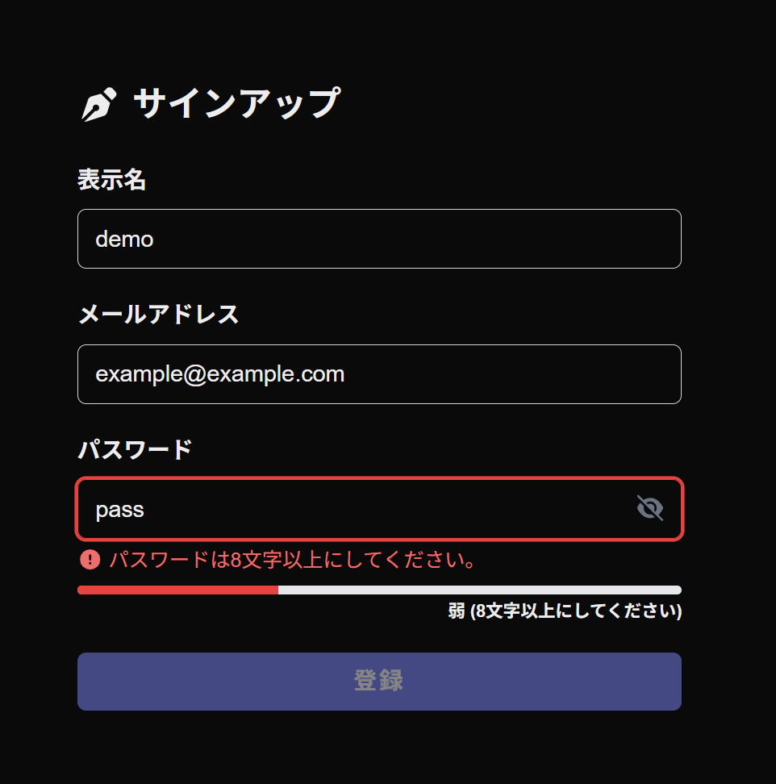
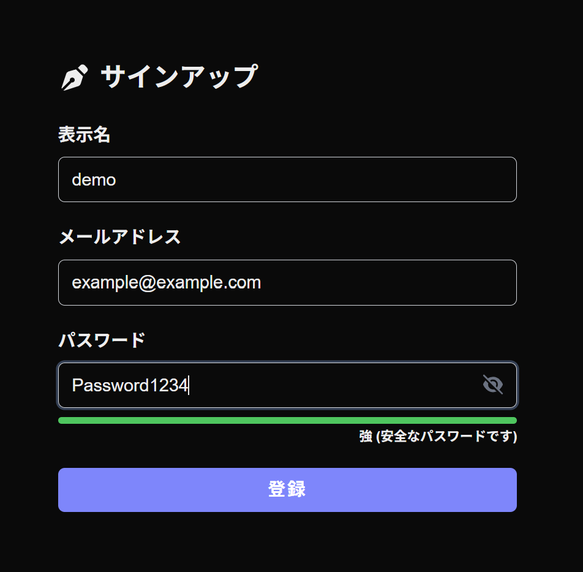
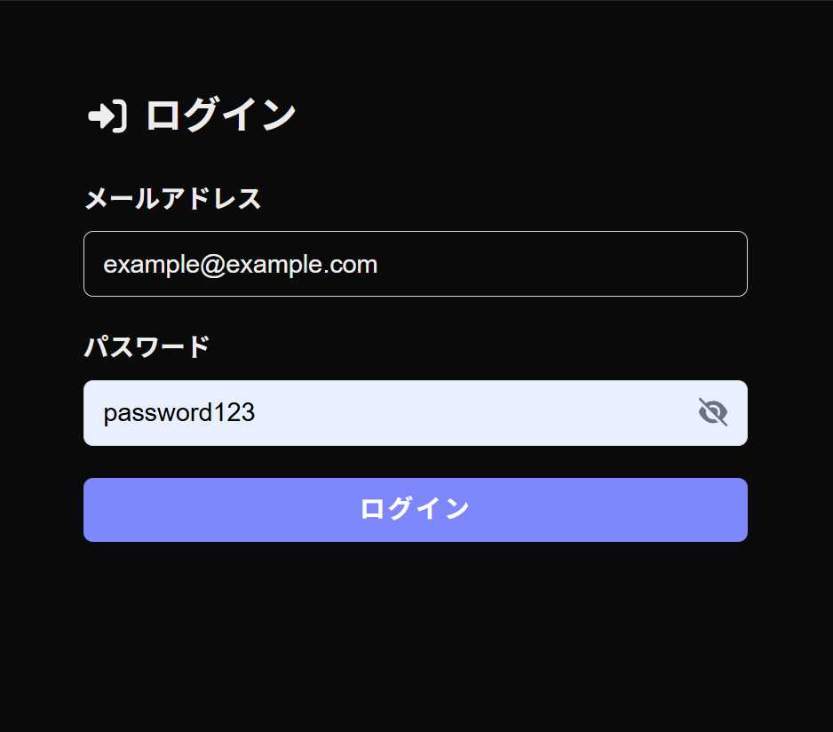
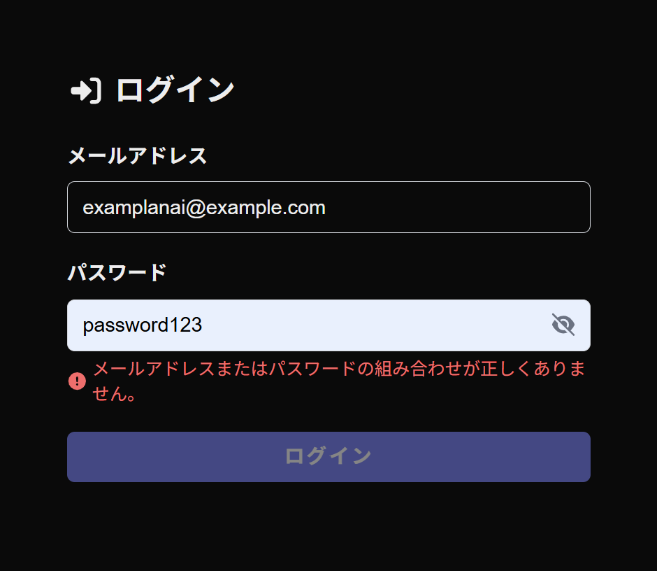
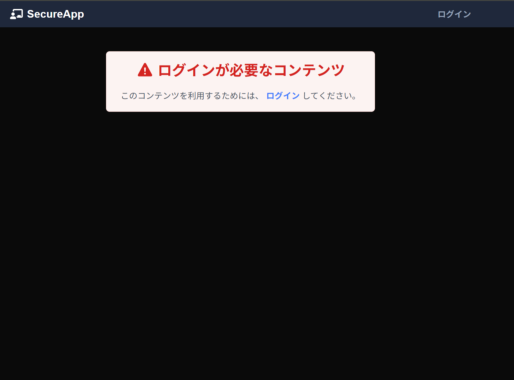

# Secure Auth App - セッションベース認証アプリ

本リポジトリは、Next.jsを用いたセキュアな認証・認可機能を備えたウェブアプリです。
本番環境での運用を想定した「ガチガチにセキュアな設計」へとリファクタリングを行いました。

## 🎯 実装した追加機能（独自実装）

認証・認可関連機能として、以下の2つのUI/UX改善機能をフロントエンドに実装しました。

### 1. パスワード強度をリアルタイム表示する機能（サインアップ画面）

ユーザーが安全なパスワードを設定できるよう、入力中の文字列をリアルタイムに監視（`react-hook-form` の `useWatch` を使用）し、パスワードの強度を視覚的なプログレスバーでフィードバックする機能を実装しました。

- **弱（赤色）**: 8文字未満
- **中（黄色）**: 8文字以上だが、英大文字・数字が混在していない
- **強（緑色）**: 8文字以上かつ、英大文字・数字が混在している（安全）

### 2. パスワードの表示・非表示を切り替える機能（ログイン・サインアップ画面）

複雑なパスワードを入力する際のユーザビリティを向上させるため、入力欄の右端にある「目のアイコン」をクリックすることで、パスワードのマスク（`●●●`）と平文表示（`text`）をトグル式で切り替えられるように実装しました。

---

## 📸 画面キャプチャ（実装の様子）

### 1. パスワード強度の表示（弱・赤色）

_▲ 8文字未満の場合、Zodのバリデーションエラーと共に赤色の警告バーを表示します。_

### 2. パスワード強度の表示（強・緑色）

_▲ 安全なパスワードが入力されると、バーが最大まで伸びて緑色に変化します。_

### 3. パスワード表示切替機能（平文表示時）

_▲ 目のアイコンをクリックするとパスワードの表示・非表示を切り替えることができます。_

### 4. アカウント列挙攻撃対策（ログイン画面のエラー）

_▲ ユーザーが存在しない場合でも、パスワード間違い時と同じ「メールアドレスまたはパスワードの組み合わせが正しくありません」という統一メッセージを表示し、アカウント列挙攻撃を防いでいます。_

### 5. 未ログイン時のアクセス制限（認可機能）

_▲ 未ログイン状態でプロフィール編集画面（`/member/about`）などの保護されたルートに直接ア
クセスしようとした際、レイアウト側でアクセスを遮断し、ログインを促す認可ガードが働きます。_

---

## 🔒 徹底したセキュリティ対策と改善点

セキュアな設計を実現するため、以下の設計を行いました。

### 1. セッションベース認証への完全移行とCookieのセキュア化

- Cookieの名称を、セッションハイジャックの標的になりやすい `session_id` から `app_session` に変更。
- Cookieの `secure` 属性を `process.env.NODE_ENV === "production"` となるように設定し、本番環境（デプロイ時）に自動的にHTTPS必須となるように修正。

### 2. アカウント列挙攻撃の防止

- サインアップ時：登録済みメールアドレスが入力された際、「既に使用されています」という直接的なエラーを出さず、汎用的なエラーメッセージに変更。
- ログイン時：ユーザーが存在しない場合とパスワードが間違っている場合のエラーメッセージを完全に統一。

### 3. 情報漏洩（内部エラーの隠蔽）対策

- データベース接続エラーなど、バックエンド側で例外が発生した際、コンソールにはエラー内容を出力しつつ、クライアント（ブラウザ）へ返す `message` には内部情報を一切含めない汎用的な文言（「通信エラーが発生しました」等）に統一。

### 4. パスワードの安全な保存

- `bcryptjs` を利用し、ソルト付きハッシュ（コスト10）化してからデータベースに保存。平文での保存は一切行っていません。

### 5. XSS（クロスサイトスクリプティング）対策

- ユーザーが入力した公開プロフィール（About）のHTMLコンテンツを表示する際、`isomorphic-dompurify` を使用して危険なタグやスクリプトをサニタイズしてからレンダリングしています。

---

## 💻 技術スタック

- **Framework:** Next.js (App Router)
- **Language:** TypeScript
- **Database:** SQLite / Prisma ORM
- **Styling:** Tailwind CSS
- **Form & Validation:** react-hook-form / Zod / DOMPurify
- **Authentication:** セッションベース認証 (カスタム実装) / bcryptjs

## ⏱️ 取り組み時間

- 約12時間
